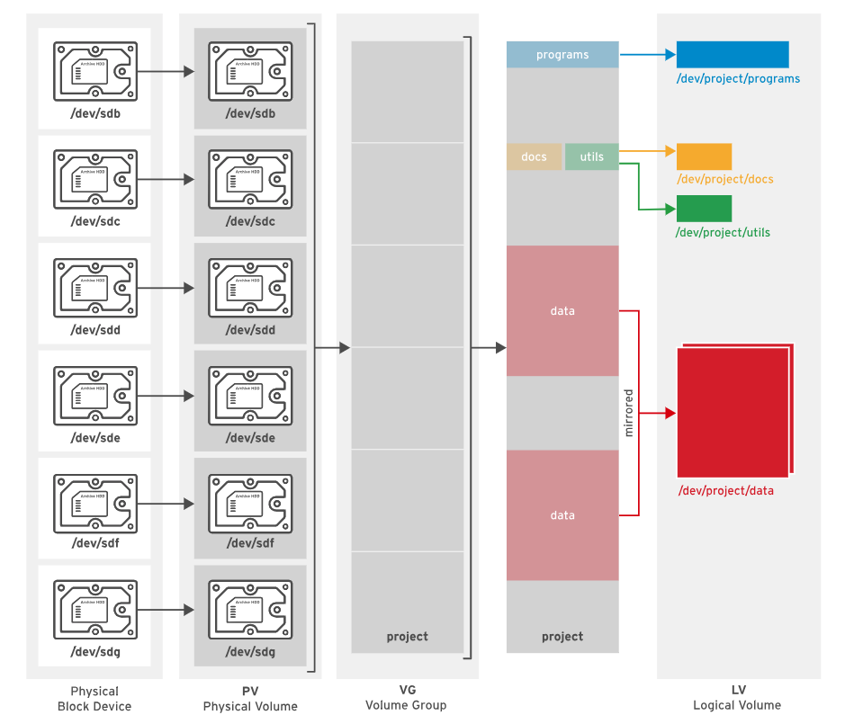
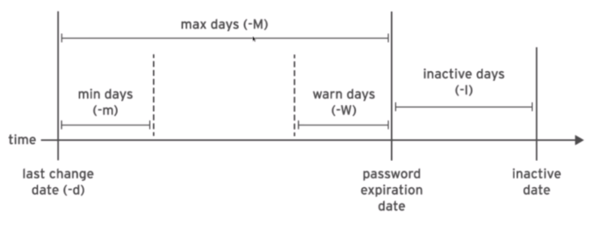
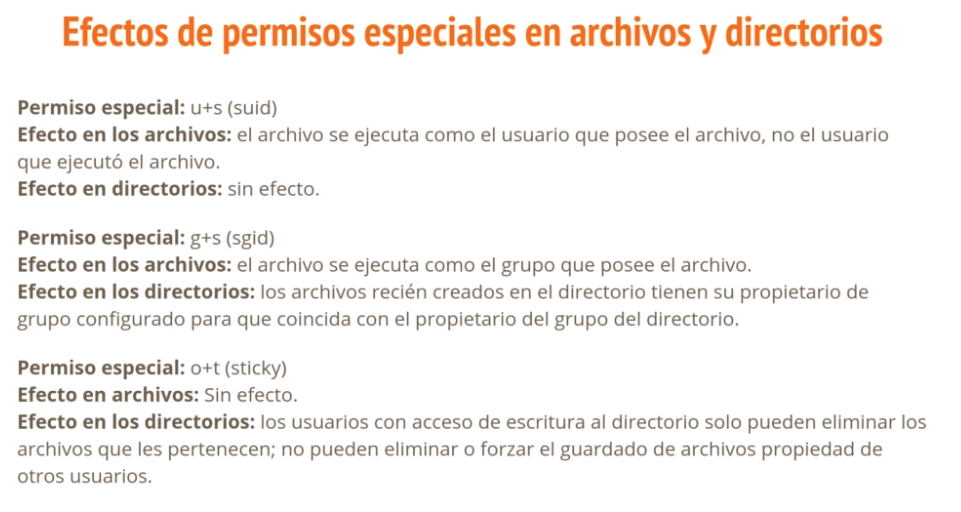
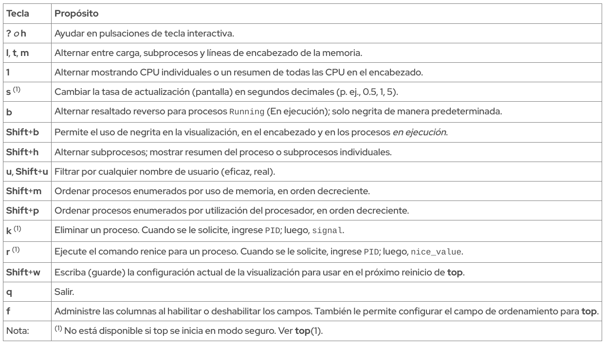

# Resumen Examen RHCSA

## ***Network***

***Ruta***

/etc/sysconfig/network-scripts/ifcfg-enp7s0

Configuracion Basica de una interfase de Red
```
TYPE=Ethernet
ONBOOT=yes
BOOTPROTO=none  //Direccion IP Manual
DEVICE=enp7s0
NAME=enp7s0
IPADDR1=192.168.20.126
PREFIX=24
GATEWAY=192.168.20.1
DNS1=192.168.20.50
```

### Informacion de las interfaces de Red
```shell
# ip a
# ip addr
Solo mostrara los datos de la interfas de Red
# ip addr show enp7s0
Muestra las estadisticas de la tarjeta de Red
# ip -s link show enp7s0
Informacion de nuestro route
# ip route
# ping -c4 192.168.0.1
Saltos entre sistemas
# tracepath google.com
Informacion de los sockets
# ss -ta
# ss -lt
```

### Administrar conexiones
```shell
Directorio
# /etc/sysconfig/network-scripts/ifcfg-enp1s0
Muestra las conexiones
# nmcli connection show
Mustra las interfases
# nmcli device status
Informacion de una interfase
# nmcli device show enp1s0
Crear una nueva conexion
# nmcli connection add con-name second ifname enp7s0 type ethernet ipv4.address 192.168.20.123/24 gw4 192.168.20.1 ipv4.dns 8.8.8.8
Agregar DNS
# nmcli connection modify second ipv4.dns 192.168.20.50
Agregar otro DNS
# nmcli connection modify second +ipv4.dns 192.168.20.50
Siempre verificar para que active la conexion desde el inicio
# nmcli connection modify second connection.autoconnect yes
Reiniciar una conexion
# nmcli connection down enp7s0 ; nmcli connection up enp7s0
Connectar una interfase
# nmcli device connect enp7s0 
```

***Ruta*** 

/etc/hostname

### Nombre de Host
```shell
# hostnamectl status
Establecer el nombre del host
# hostnamectl set-hostname rhel8cliente1.labrhel.com
```

***Ruta*** 

/etc/hosts
/etc/resolv.conf

### Resolucion de nombres de Host
```
192.168.20.50 rhel8master.labrhel.com master master1 master2
```

```shell
Revision de nombres de host
# host master
# ping master
# getent host master
```

## ***Paquetes***

```shell
Packetes
# yum search guile
# yum list 'http*'
# yum info guile
# yum install guile
# yum remove guile

Grupos
# yum group list
# yum groip info Packetes
# yum group install Packete
Mustra el historial de instalaciones
# yum history 
Mustra la informacion relacionada al punto 5
# yum history info 5
Elimina el paquete que se instalo en el punto 5
# yum history undo 5
```

### Repositorios

Ruta

/etc/yum.repos.d/ sin key

```
[base1]
name=Nombre del repo
baseurl=https://cdn.redhat.com/content/dist/layered/rhel8/x86_64/rhosdt/2/source/SRPMS
enable=1
gpgcheck=0
```
/etc/yum.repos.d/ con key

```
[base1]
name=Nombre del repo
baseurl=https://cdn.redhat.com/content/dist/layered/rhel8/x86_64/rhosdt/2/source/SRPMS
enable=1
gpgcheck=1
gpgkey=file:///ect/pki/rpm-gpg/key
```

Agregar un repo por comando
```shell
# dnf install dnf-utils
# yum-config-manager --add-repo=https://cdn.redhat.com/content/dist/layered/rhel8/x86_64/rhosdt/2/source/SRPMS
# yu,-config-manager --enable
```

Actualizar el kernel
```shell
# yum install kernel
# yum update kernel
Reiniciar
Si queremos bajar un repo y configurarlo en local
# yum instal -y httpd
# systemctl start httpd ; systemctl enable httpd
# firewall-cmd --permanent --add-service=http
Ruta http://IP_adds/repos
# reposync --repoid=rhel-8-for-x86_64-appstream-rpms -p /var/www/html/repos/ --downloadcomps --download-metadata
# uname -r
# yum list kernel
```

### Modulos
```shell
Lista los modulos
# yum module list
Lista los modulos especificos
# yum module list idm
Activa el modulo para poder instalarlo
# yum module enable idm
Instala el modulo con una version
# yum module install idm:DL1
Instala el modulo con una version y perfil
# yum module install idm:DL1/server
Desinstalar modulo
# yum modulo remove idm...
Listar los repos
# yum repolist --all
```

## Servicios

```shell
# systemctl list-unit-files 
# systemctl list-unit-files -t service
# systemctl list-unit-files -t socket

# systemctl status chrony
# systemctl start chrony
# systemctl enable chrony
# systemctl disable chrony
# systemctl stop chrony

# systemctl is-active chrony
# systemctl is-enable chrony
```

### Cambiar el target por defecto
```shell
Traer el target por default
# systemctl get-default
Establecer otro target
# systemctl set-default multi-user.target
Para cambiar el target al momento del boot detener el arranche "e" y agregar
... rhgb quiet systemd.unit=graphical.target
```

### Cambiar contraseña de Root
```shell
Reiniciar la maquina y detener el boot y presionar "e" y agregar
rd.break
# mount -o remount,rw /sysroot
# chroot /sysroot
# echo "holamundo" | passwd root --stdin
o
# passwd root 
Escribimos la nueva contraseña
# touch /.autorelabel
Hace un relabel de todo el sistema
# exit
# exit
```

## Particion de discos

```shell
Comando para ver los discos
# lsblk
Archivo de discos
# cat /proc/partitions
Ver particiones
# parted /dev/vda print
Establecer el tipo de particion
# parted /dev/vdb mklabel msdos/gpt
Se recomiendo gpt si los discos son >= 2TB
# parted /dev/vdb
# > mkpart
Type = primary, extended, logical
Start = 1M
End = 500MB
Al terminar 
# udevadm settle

La otra opcion es con 
# fdisk -l

# gdisk

```

## Sistema de Archivos
```shell
# mkfs.ext4 /dev/vdb1

Montar un disco manual
# mount /dev/vdb1 /mnt/

Montar un disco de forma permanente
/etc/fstab

Dentro del archivo
# /dev/vdb1   /mnt/disk1  ext4    default 0   0

Ejecutar los siguientes comandos despues de modificar el fstab
# systemctl deamon-reload
# mount -a
```

## SWAP
```shell
Se debe crear una particion con el tipo SWAP con fdisk o gdisk
# mkswap /dev/vdb3

# echo "/dev/vdb3 swap swap default 0 0" >> /etc/fstab
# systemctl deamon-reload

Para montar una particion SWAP
# swapon /dev/vdb3

Para revisar la memoria
# free -h

Como definir la prioridad de las particiones SWAP en el archivo fstab
/dev/vdb3   swap    swap    pri=10  0   0
/dev/vdc3   swap    swap    pri=5  0   0
/dev/mapper/RHEL   swap    swap    pri=-1  0   0

# 10 mayor prioridad a menor prioridad -1

Para mostrar las prioridades de swap usar
# swapon --show 

```

## Volumenes logicos



```shell
Como crear un volumen logico con parted
# parted /dev/vdb mklabel msdos
# parted /dev/vdb mkpart primary 1M 500M
# parted /dev/vdb print set 1 lvm on
# parted /dev/vdb print

Como crear un volumen logico con fdisk
# fdisk /dev/vdb
# p - print
# n - new
# t - type
# w - save
# udevadm settle

Iniciar un volumenes fisicos para usar con LVM
# pvcreate /dev/vdb1
# pvdisplay
# pvs

Grupo de volumenes logicos para poder juntar discos y crear mas espacio
# vgcreate vg9 /dev/vdb1 /dev/vdb2
# vgdisplay
# vgs

Creamos los volumenes logicos
# lvcreate vg9 -n lv_01 -L 250M
# lvdisplay

Definir formato
# mkfs.xfs /dev/vg9/lv_01

Eliminar
# lvremove /dev/lv_01
# vgremove vg9
# pvremove /dev/vdb1

Crear un partition table con parted y gpt
# parted -s /dev/vdb mklabel gpt
# parted /dev/vdb print
Crear particiones
# parted -s /dev/vdb mkpart primary xfs 1MiB 250MiB
Establecerla como lvm
# parted -s /dev/vdc set 1 lvm on

Crear una partivion con gdisk
# gdisk /dev/vdb
Se desplegaran una serie de preguntas
# w
Para guardar los cambios
# udevadm settle

Se etiquetan como physical volume
# pvcreate /dev/sdb1 /dev/sdb2
Creamos un volumen de grupo
# vgcreate -s 8m vg_data /dev/sdb1 /dev/sdb2
# vgdisplay vg_data
Creamos un volumen con base en el grupo
# lvcreate vg_data -n lv_data1 -l 10
Crea un volumen logico de 80MB
# lvdisplay /dev/vg_data/lv_data1
Seria lo mismo crear el volumen con 
# lvcreate vg_data -n lv_data1 -L 80M
# mkfs.xfs /dev/vg_data/lv_data1
Para ver la ruta completa
# lsblk -fp
Lo montamos de forma permanente
# echo "/dev/mapper/vg_data-lv_data1 /mnt/lv01 xfs defaults 0 0" >> /etc/fstab 
Para reiniciar el daemon 
# systemctl daemon-reload
Montamos todos los volumenes
# mount -a
Verificamos que se montaran
# df -h

Si creamos una nueva particion y no aparece 
# partprobe -s
Para verificar 
# lsblk -fp 

Extender un PV con un grupo existente
# vgextend vg_data /dev/vdc2

Despliega informacion acerca de los volumenes de grupo
# vgs

Despliega informacion acerca de los volumenes fisicos
# pvs

Remover volumen del grupo 
# vgreduce vg_data /dev/vdc2
Si tiene datos primero se tiene que vaciar el volumen fisico y debe tener espacio el grupo 
# pvmove /dev/vdc1

Si queremos agrandar el volmen de grupo 
# vgextend vg_data /dev/vdc1
Si queremos agrandar el volumen fisico en modo test
# lvextend /dev/vg_data/lv_data1 -L +80M -r -t
Si queremos agrandar el volumen fisico
# lvextend /dev/vg_data/lv_data1 -L +80M -r
Si queremos reducir el volumen fisico
# lvreduce /dev/vg_data/lv_data -L -10M -r -t /Usar -t para validar antes de ejercutar

En caso de aplicar el comando anterior para XFS sin la opcion de -r se requiere 
# xfs_growfs

Extender SWAP (Primero debemos agregar espacio al VG)
# swapoff -v /dev/rhel/swap
# free -h
# lvextend  /dev/rhel/swap -l +100%FREE
# mkswap /dev/rhel/swap 
# swapon -av /dev/rhel/swap

Stratis
Instalar los paquetes necesarios
# yum install stratis-cli stratisd
# systemctl status stratisd
# systemctl start stratisd
# systemctl enable stratisd

Creamos un pool
# stratis pool create lab_pool /dev/vdb /dev/vdc
Verificar el pool
# stratis pool list
Agregar un nuevo disco a un pool existente
# stratis pool add-data lab_pool /dev/vdd
Eliminar el Pool
# stratis pool destroy lab_pool
Crear un filesystem
# stratis filesystem create lab_pool file_system1
Valiar el filesystem
# ls -las /stratis/lab_pool/
Podemos crear un snapshot
# stratis filesystem snapshot lab_pool file_system1 snap_file_system1
# stratis filesystem list
Montar, agregamos la sig linea al /etc/fstab
UUID=XXX /dir_stratis xfs default,x-systemd.requires=stratisd.service 0 0
# systemctl daemon-reload
# mount -a
Montar snapshot 
# mount /stratis/lab_pool/snap_file_system1 /snap/stratis
Eliminar snapshot
# stratis filesystem destroy lab_pool snap_file_system1

Compresion de almacenamiento
Instalar los paquetes para usar
# yum install vdo kmod-kvdo 
# vdo create -n vdo01 --device /dev/vdd --vdoLogicalSize 20G
# vdo status
# vdo list
# vdo stop -n vdo01
# vdo start -n vdo01
Le damos un formato 
# mkfs.xfs -K /dev/mapper/vdo01
# udevadm settle
# lsblk -fp
# lsblk --output=UUID /dev/mapper/cdo01
# echo "UUID=5aff20e0-67a6-47b3-ac32-dce034c26360 /dir_vdo xfs defaults,x-systemd.requires=vdo.service 0 0" >> /etc/fstab
# systemctl daemon-reload
# mount -a
Para ver estadisticas se usa
# vdostats --human-readable
# vdo status | grep -i compres
# vdo status ! grep -i dedupli
```

## NFS Storage
```shell
# mount rhel8master:/ /mnt/
# showmount -e rhel8master
# nfsconf --set nfsd vers4.2 y
# nfsconf --unset nfsd vers4.2 y
# nfsconf --unset nfsd udp n
# nfsconf --unset nfsd vers2 n
# nfsconf --unset nfsd vers3 n
# nfsconf --unset nfsd tcp y
# nfsconf --unset nfsd vers4 y
# nfsconf --unset nfsd vers4.0 y
# nfsconf --unset nfsd vers4.1 y
# nfsconf --unset nfsd vers4.2 y
# mount -t nfs rhel8master.labrhel.com.com:/srv/nfs /public_nfs
# echo "rhel8master.labrhel.com:/srv/nfs /public_nfs nfs rw,sync 0 0" >> /etc/fstab
# systemctl daemon-reload
# mount -a

Automztizar el montaje de recursos indirecto
# yum install autofs
# systemctl enable --now autofs
# cat /etc/auto.master
Creamos el archivo dentro de la carpeta auto.master.d y debe terminar con autofs
# vi /etc/auto.master.d/public.autofs
/public /etc/indirectpublic.test
:wq
# echo "nfs -rw,sync rhel8master.labrhel.com:/srv/nfs" > /etc/indirectpublic.test

Ejemplo 2
# vi /etc/auto.master.d/demo.autofs
/share /etc/auto.demo
# vi /etc/auto.demo
master -rw,sync rhel84master.labrhel.com:/root/rhshare/

# systemctl restart autofs
Vamos al directorio de nfs
# cd /public
# cd nfs
# df -hT
Otra opcion con comodines, para aceptar varios directorios
# echo "* -rw,sync,fstype=nfs4 rhel8master.labrhel.com:/srv/indirect/&" > /etc/indirectpublic.test
# cd /indirect/*

Automatizar el montaje de forma directa
# vi /etc/auto.master.d/public.autofs
/- /etc/directpublic.test
:wq
# vi /etc/directpublic.test
/mnt/nfs -rw,sync rhel8master.labrhel.com:/srv/nfs
:wq
# systemctl restart autofs
Otra opcion pude ser
/mnt/nfs -rw,sync,fstype=nfs4 rhel8master.labrhel.com:/srv/direct/externo
:wq

```

## Analisis y alamcenamiento de registros del sistema
```shell
Chrony
# timedatectl
# timedatectl list-timezones
# timedatectl set-timezone Antarctica/Sywowa
# timedatectl set-time 9:00:00
# timedatectl set-ntp true
Sirve para sincronizar de forma automatica con el time zone

Configurar Chronyd
# rpm -qa | grep chrony
# systemctl status chronyd
# chronyc tracking
# chronyc sources -v
# vim /etc/chrony.conf
Comentar el pool dentro del archivo o agregar el server
server rhel8master.labrhel.com iburst
# systemctl restart chronyd
Verificar en el archivo chrony.conf del servidor
allow 192.168.20.0/24
Para seleccionar zonas horarias con un asistente seria con
# tzselect

Journal
Ubicacion
# ls -las /run/log/journal/XXXXXX
Archivo de configuracion
# vim /etc/systemd/journald.conf
Storage=persistent
SystemMaxUse=2048M
SystemMaxFileSize=100M
# systemctl restart systemd-journald
# journalctl | grep -E 'Runtime|System journal'
# journalctl --disk-usage

Revisar registro del sistema
Registros del inicio de la maquina
# journalctl -b 1
# journalctl --list-boots
# journalctl -n 20
# journalctl -f 
# journalctl -p err
# journalctl --since "-1 hour"
# journalctl -f -u sshd
# journalctl -o verbose

Campos comunes en el journal del sistema
_COMM El nombre del comando
_EXE El Camino al ejecutable para el proceso
_PID El PID del proceso
_UID El UID del usuario que ejecuta el proceso
_SYSTEMD_UNIT La unidad systemd que inicio el proceso

``````

## Registro del sistema Syslog

```shell
# cd /var/log
```

|Codigo|Prioridad|Severidad|
|---|---|---|
|0|emerg|El sistema es inutilizable|
|1|alert|La accion debe ser tomada inmediatamente|
|2|crit|Condicion critica|
|3|err|Condicion de error no critico|
|4|warning|Condicion de advertencia|
|5|notice|Evento normal pero significativo|
|6|info|Evento Informativo|
|7|debug|Mensaje de nivel de depuracion|

```shell
Configuraciones customizadas 
# vim /etc/rsyslog.conf

Logrotate
# vim /etc/logrotate.conf
```

## SELinux
```shell
Para revisar el modo en que esta SELinux
# getenforce
Cambiar el modo de SELinux
# setenforce Permissive
# cat /etc/selinux/config
Cambiar SELinux de forma permanente 
# sed -i -e "s/SELINUX=enforcing/SELINUX=permissive/" /etc/selinux/config
Cada que se cambie el SELINUX se debe reiniciar
# who -r 
Para saber en que nivel de consola estamos corriendo el usuario

Se instalo httpd y buscamos el contexto
# ls -ldZ /var/www/html/
# touch /var/www/html/123.html
# ls -lZa /var/www/html muestra todos los archivos con su contexto
# touch ~/test-1
No cambia el contexto
# mv ~/test1 /var/www/html/
Si cambia el contexto
# cp ~/test1 /var/www/html/
Si queremos cambiar el contexto
# restorecon -Rv /var/www/html/
 Cambiar contextos temporal
 # chcon -t httpd_sys_context_t /apache2

Cambios en /etc/httpd/conf/httpd.conf
 DocumentRoot "/apache2"

#
# Relax access to content within /var/www.
#
<Directory "/apache2">
    AllowOverride None
    # Allow open access:
    Require all granted
</Directory>

Manejo de Contextos
# semanage 
# man -k semanage
Cambiar permanente
# semanage fcontext -a -t httpd_sys_content_t '/apache2(/.*)?'
# semanage port -a -t http_port_t -p tcp 82
Para corroborar
# semanage fcontext -l | grep apache2
# semanage fcontext -l | grep http

Recarvar los contextos correctos
# restorecon -Rv

Booleans
# getsebool -a 
# semanage boolean -l
Cambiar boolean temporal
# setsebool XXX on
Cambiar permanente
# setsebool -P XXX

# vi /etc/httpd/conf.d/userdir.conf


Activar Cockpit
# systemctl enable --now cockpit.socket
Inspeccionar (Tambien se puede usar la web)
# less /var/log/audit/audit.log
Para ver de forma amigable los logs
# sealert -a /var/log/audit/audit.log
# less /var/log/messages
# semodule -l XXX

# ausearch -m AVC -ts recent

```

## Firewall
```shell
# ls /etc/firewalld
Muestra todas las zonas
# firewall-cmd --list-all-zone
Muestra solo las zonas activas
# firewall-cmd --list-all
# firewall-cmd --get-default-zone
Para ver zonas especificas
# firewall-cmd --list-all --zone=dmz
Cambiar la zona por defecto
# firewall-cmd --set-default-zone --zone=dmz
Agregamos un servicio y lo hacemos permanente
# firewall-cmd --add-service=samba --permanent
Agregamos un puerto
# firewall-cmd --add-port=8080/tcp --permanent

Mostrar todos los servicios
# firewall-cmd --get-service
Muestra todas las zonas
# firewall-cmd --get-zones
Despues de cada cambio
# firewall-cmd --reload
```

## Gestion de Usuarios y Grupos
```shell
Informacion de los usuarios
# id
# getent ...
Informacion de los grupos
# cat /etc/group

Superusuario
Cambiar de usuario (Si no existe lo crea)
# su - ger
Para crear el Password
# passwd ger
Elevar privilegios (root)
# su -

Sudo usa la misma contraseña del usuario
# 
Editar el archivo de sudoers
# visudo /etc/sudoers
Elevar privilegios para un grupo especifico en /etc/sudoers.d/
# echo "ger ALL=(ALL) NOPASSWD: ALL" > ger_user
 
Grupos
# groupadd -g 7878 developers
# useradd admin1 -G admins
# id admin1
# useradd dev1 -u 1020
# usermod -aG developers
# tail -n2 /etc/group
# getent group admins
Acceso sudo
# echo "%admins ALL=(ALL) ALL" > /etc/sudoers.d/admins
Comprobar
# tail /var/log/messages
# sudo tail /var/log/messages

Contraseñas
Antes
# cat /etc/passwd
Ahora
# cat /etc/shadow
Cambiar o asignar la contraseña
# passwd ger
Para ver los detalles de la contraseña
# chage -l ger 
Minimo de dias, Max, warndays, inactive, expiration
# chage -m 2 -M 90 -W 6 -I 4 -E 2023-12-01 ger
Para que cambie el usuario la contraseña en el proximo loggeo
# chage -d 0 ger
Calcular la fecha
# date -d "+87 days" +"%Y-%m-%d"
Restringir el acceso de un usuario
# usermod -L dev
# usermod -L -e 2023-11-13 dev

Configuraciones globales
# vi /etc/login.defs
```


## Archivos

|Usuario |Grupo |Otros|
|--------|------|-----|
|rwx     |rwx   |rwx  |
|421     |421   |421  |

```shell
# chmod u-w Directorio
# chmod u+w Directorio
# chmod u=rwx,g=rwx,o=rwx Directorio
# chmod a+w Directorio Quita el premiso de ejecucion

Agregar permiso de ejecucion
# chmod -R o+X LAB11

Cambiar al propietario del archivo
# chown ger file99
Cambiar al propietario del archivo y el grupo
# chown ger:admins file99
Cambiar el grupo del archivo
# chown :admins file99
# chgrp admins file99

Permisos especiales
# suid
# sgid

Umask (sirve para crear todos los archivos y directorios con los mismos permisos)
777 - 644
# umask 0133
# echo "umask 0027" >> .bashrc

Permisos especiales a un directorio a nivel grupo
# chmod -R g+s contabilidad/
# chmod 2770 servicios/ grupos
# chmod 3770 servicios/ otros
# chmod 3771 servicios/ pasar de T a t

# chmod u=rwx,g=srwx,o=t--- servicios/
```



## Programacion de tareas futuras
```shell
Programar acciones futuras o repetitivas
# crontab -l
# cat /etc/crontab
# echo "* * * * * /usr/sbin/ip a >> /home/ger/ip_settings" > cron_file
# crontab cron_file
# crontab -l 
# crontab -l -u ger
Para los archivos dentro de /etc/cron.d/ requieren tener definido el usuario
# echo "*/2 08-20 * * Mon-Sat ger /usr/bin/date >> /home/ger/crone-date.txt" > date_file
# echo "*/2 08-20 * * Mon-Sat root /usr/bin/date >> /home/ger/crone-date.txt" > /etc/cron.d/date_file
# chmod 0644 /etc/cron.d/date_file
Si los archivos se encuentran dentro de /etc/cron.d/date_file se ejecutan en automatico (chmod +x date_file)
```

## Manejo de archivos temporales
```shell
# cp /usr/lib/tempfiles.d/tmp.conf /etc/tempfiles.d/
# systemd-tmpfiles --clean /etc/tmpfiles.d/tmp.conf
# vim /etc/tmpfiles.d/momentaneos.conf
Dentro del archivo
d /run/momentaneos 0700 root root
# systemd-tmpfiles --create /etc/tmpfiles.d/momentaneos.conf
Para ejecutar la limpieza hacemos un clean
# systemd-tmpfiles --clean /etc/tmpfiles.d/momentaneos.conf
```

## Monitoreo
 
```shell
# top
# ps
# lscpu
# uptime
```

## Optimizar
```shell
# yum install tuned
# systemctl enable --now tuned
# tuned-adm active
# tuned-adm list
# tuned-adm profile powersave
# tuned-adm recommend
```

## Contenedores
```shell
# yum module install container-tools
# podman pull url-registry:latest
# podman images
# podman inspect url-image
# podman rmi images
Si el usuario NO es root el puerto debe ser mayor que 1024
Con la opción Z, Podman aplica automáticamente el tipo de contexto container_file_t SELinux al directorio de host.
# podman run --name=rhel8 -d -p 8080:8080 -e MYSQL_USER=admin -v /home/ger/app:/var/lib/mysql:Z url-registry:latest
# podman -a
# podman ps
# podman ps -a
# podman start pod
# podman stop pod
# podman restart pod
# podman rm pod
# podman kill pod
# podman exec pod cat /etc/redhat-release
# podman exec -it pod /bin/bash
# firewall-cmd --add-port=8000/tcp

/etc/containers/registries.conf

# podman info
# podman search url-registry/rhel8
# podman --no-trunc url-registry/rhel8

Revisar una imagen antes de descargarla
# skopeo inspect docker://registry.access.redhat.com/rhel8/toolbox

Contenedores como servicio
Este comando crear un archivo container-web.service y --name hace referencia al nombre del pod
# mkdir /home/ger/.config/systemd/user
# podman generate systemd --name web --files --new
# cp container-web.service /home/ger/.config/systemd/user
# systemctl --user daemon-reload
# systemctl --user enable container-web
# systemctl --user start container-web
# systemctl --user status container-web
# loginctl enable-linger ger 
o
# loginctl enable-linger $USER 

# loginctl enable-linger
# loginctl show-user user
# loginctl disable-linger
```
